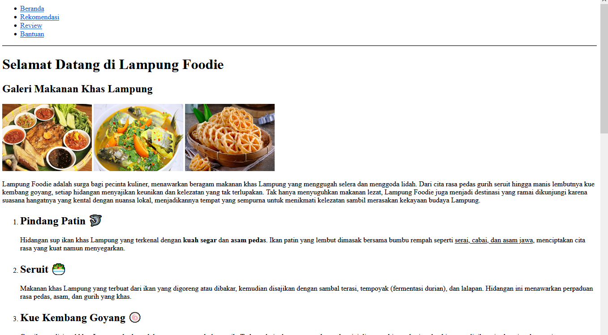

# Lampung Foodie 🍽️

Welcome to **Lampung Foodie**, a website dedicated to showcasing the rich and diverse culinary heritage of Lampung, Indonesia. From savory dishes like *Pindang Patin* to sweet treats like *Kue Kembang Goyang*, this project provides visitors with a glimpse of the local flavors through beautiful galleries, reviews, and even price information!



---

## 📖 Table of Contents
- [Features](#features)
- [Technologies Used](#technologies-used)
- [Installation](#installation)
- [Usage](#usage)
- [Screenshots](#screenshots)

---

## 🚀 Features

- **Dynamic Navigation**: Easily browse between the homepage, recommendations, reviews, and help sections.
- **Food Gallery**: A visual feast with images of traditional Lampung dishes.
- **Detailed Descriptions**: Learn about the unique flavors and ingredients of each dish.
- **Embedded Videos**: Watch culinary videos to dive deeper into Lampung’s food culture.
- **Pricing Information**: Transparent pricing for popular dishes like *Seruit* and *Pindang Patin*.
- **Contact Form**: Reach out to us with questions or feedback through our simple contact form.

---

## 🛠️ Technologies Used

- **HTML5**: The latest version of HTML, providing the structure for the web pages.
- **CSS (inline)**: For basic styling of the website elements.
- **SVG Icons**: Used for the contact section (phone, Instagram, YouTube, Twitter X).
- **YouTube API**: For embedding culinary video content.
  
---

## 🖥️ Installation

1. **Clone the repository**:
    ```bash
    git clone https://github.com/krossmanzs/lampung-foodie.git
    ```
2. **Open the project folder**:
    ```bash
    cd lampung-foodie
    ```
3. **Run the project**:
    Simply open the `index.html` file in your browser to see the website live.

---

## 💡 Usage

- **Homepage**: The welcoming section introduces the website and its purpose.
- **Food Gallery**: Scroll through images of traditional Lampung dishes such as *Seruit*, *Pindang Patin*, and *Kue Kembang Goyang*.
- **Video Section**: Watch a video about Lampung’s famous foods to learn more about its culinary heritage.
- **Pricing Information**: Explore the typical prices for Lampung dvelicacies.
- **Contact Us**: Fill out the contact form to send feedback or inquiries about the website or the food culture.

---

## 📸 Screenshots

### Food Gallery


---
